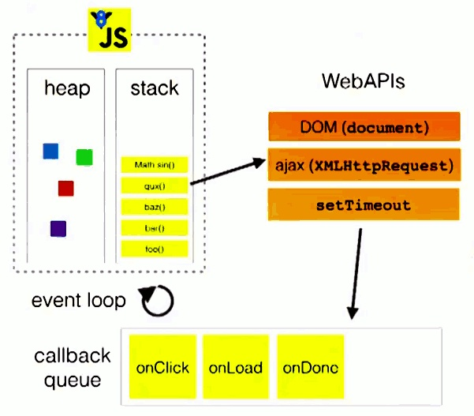

# 浏览器相关

## 浏览器架构

- 用户界面
- 主进程
- 内核
  - 渲染引擎
  - JS 引擎
    - 执行栈
  - 事件触发线程
    - 消息队列
      - 微任务
      - 宏任务
  - 网络异步线程
  - 定时器线程

## 浏览器是多进程的

每打开一个Tab页，就相当于创建了一个独立的浏览器进程， 可以在`Chrome的任务管理器`中看到。（浏览器应该也有自己的优化机制，有时候打开多个tab页后，可以在Chrome任务管理器中看到，有些进程被合并了。所以每一个Tab标签对应一个进程并不一定是绝对的）

### 浏览器包含哪些进程

```
Browser进程
```

- 浏览器的主进程，协调控制其他子进程（创建、销毁）
- 浏览器界面显示，用户交互，前进、后退、收藏
- 将渲染进程得到的内存中的Bitmap，绘制到用户界面上
- 处理不可见操作，网络请求，文件访问等

```
GPU进程
```

-  用于3D绘制等（最多一个） 

```
第三方插件进程
```

-  每种类型的插件对应一个进程，仅当使用该插件时才创建  

```
渲染进程（浏览器内核）
```

- 负责页面渲染，脚本执行，事件处理等
- 默认每个tab页一个渲染进程

### 浏览器多进程的优势

相比于单进程浏览器，多进程有如下优点：

- 避免单个page crash影响整个浏览器
- 避免第三方插件crash影响整个浏览器
- 多进程充分利用多核优势
- 方便使用沙盒模型隔离插件等进程，提高浏览器稳定性

缺点：内存消耗更大

## 浏览器内核（渲染进程）

```
GUI渲染线程
```

- 负责渲染页面，解析，构建，布局和绘制
- 页面需要重绘和回流时，该线程就会执行
- 与js引擎线程互斥，防止渲染结果不可预期

```
JS引擎线程
```

- 负责处理解析和执行javascript脚本程序
- 只有一个JS引擎线程（单线程）
- 与GUI渲染线程互斥，防止渲染结果不可预期

```
事件触发线程
```

- 归属于浏览器而不是JS引擎 ，用来控制事件循环（鼠标点击、setTimeout、ajax等）
- JS引擎执行包含事件的代码块时，会将对应任务添加到事件线程中 
- 当事件满足触发条件时，将事件放入到JS引擎所在的执行队列尾部，等待JS引擎的处理 

```
定时触发器线程
```

- setInterval与setTimeout所在的线程
- 定时任务并不是由JS引擎计时的，是由定时触发线程来计时的
- 计时完毕后，通知事件触发线程

```
异步http请求线程
```

- 在XMLHttpRequest在连接后是通过浏览器新开一个线程请求 
- 检测到状态变更时，如果设置有回调函数，异步线程就**产生状态变更事件**，将这个回调再放入事件队列中，再由JavaScript引擎执行。 


### Browser进程和Renderer进程的通信过程

- Browser进程收到用户请求，首先需要获取页面内容（譬如通过网络下载资源），随后将该任务通过RendererHost接口传递给Render进程 
- Renderer进程的Renderer接口收到消息，简单解释后，交给渲染线程，然后开始渲染 
  - 渲染线程接收请求，加载网页并渲染网页，这其中可能需要Browser进程获取资源和需要GPU进程来帮助渲染 
  - 当然可能会有JS线程操作DOM（这样可能会造成回流并重绘）
  - 最后Render进程将结果传递给Browser进程 
- Browser进程接收到结果并将结果绘制出来 

### javascript 是单线程的

首先是历史原因，在创建 javascript 这门语言时，多进程多线程的架构并不流行，硬件支持并不好。

其次是因为多线程的复杂性，多线程操作需要加锁，编码的复杂性会增高。

如果同时操作 DOM ，在多线程不加锁的情况下，最终会导致 DOM 渲染的结果不可预期。

### GUI 渲染线程与 JS 引擎线程互斥

由于 JS 是可以操作 DOM 的，如果同时修改元素属性并同时渲染界面(即 `JS线程`和`UI线程`同时运行)， 那么渲染线程前后获得的元素就可能不一致了。

因此，为了防止渲染出现不可预期的结果，浏览器设定 `GUI渲染线程`和`JS引擎线程`为互斥关系， 当`JS引擎线程`执行时`GUI渲染线程`会被挂起，GUI更新则会被保存在一个队列中等待`JS引擎线程`空闲时立即被执行。

### WebWorker，JS的多线程？

前文中有提到JS引擎是单线程的，而且JS执行时间过长会阻塞页面，那么JS就真的对cpu密集型计算无能为力么？

所以，后来HTML5中支持了`Web Worker`。

MDN的官方解释是：

```
Web Worker为Web内容在后台线程中运行脚本提供了一种简单的方法。线程可以执行任务而不干扰用户界面

一个worker是使用一个构造函数创建的一个对象(e.g. Worker()) 运行一个命名的JavaScript文件 

这个文件包含将在工作线程中运行的代码; workers 运行在另一个全局上下文中,不同于当前的window

因此，使用 window快捷方式获取当前全局的范围 (而不是self) 在一个 Worker 内将返回错误
复制代码
```

这样理解下：

- 创建Worker时，JS引擎向浏览器申请开一个子线程（子线程是浏览器开的，完全受主线程控制，而且不能操作DOM）
- JS引擎线程与worker线程间通过特定的方式通信（postMessage API，需要通过序列化对象来与线程交互特定的数据）

所以，如果有非常耗时的工作，请单独开一个Worker线程，这样里面不管如何翻天覆地都不会影响JS引擎主线程， 只待计算出结果后，将结果通信给主线程即可，perfect!

### WebWorker与SharedWorker

既然都到了这里，就再提一下`SharedWorker`（避免后续将这两个概念搞混）

- WebWorker只属于某个页面，不会和其他页面的Render进程（浏览器内核进程）共享
  - 所以Chrome在Render进程中（每一个Tab页就是一个render进程）创建一个新的线程来运行Worker中的JavaScript程序。
- SharedWorker是浏览器所有页面共享的，不能采用与Worker同样的方式实现，因为它不隶属于某个Render进程，可以为多个Render进程共享使用
  - 所以Chrome浏览器为SharedWorker单独创建一个进程来运行JavaScript程序，在浏览器中每个相同的JavaScript只存在一个SharedWorker进程，不管它被创建多少次。

看到这里，应该就很容易明白了，本质上就是进程和线程的区别。SharedWorker由独立的进程管理，WebWorker只是属于render进程下的一个线程

## 浏览器渲染流程

本来是直接计划开始谈JS运行机制的，但想了想，既然上述都一直在谈浏览器，直接跳到JS可能再突兀，因此，中间再补充下浏览器的渲染流程（简单版本）

为了简化理解，前期工作直接省略成：（要展开的或完全可以写另一篇超长文）

```
- 浏览器输入url，浏览器主进程接管，开一个下载线程，
然后进行 http请求（略去DNS查询，IP寻址等等操作），然后等待响应，获取内容，
随后将内容通过RendererHost接口转交给Renderer进程

- 浏览器渲染流程开始
复制代码
```

浏览器器内核拿到内容后，渲染大概可以划分成以下几个步骤：

1. 解析html建立dom树
2. 解析css构建render树（将CSS代码解析成树形的数据结构，然后结合DOM合并成render树）
3. 布局render树（Layout/reflow），负责各元素尺寸、位置的计算
4. 绘制render树（paint），绘制页面像素信息
5. 浏览器会将各层的信息发送给GPU，GPU会将各层合成（composite），显示在屏幕上。

所有详细步骤都已经略去，渲染完毕后就是`load`事件了，之后就是自己的JS逻辑处理了

既然略去了一些详细的步骤，那么就提一些可能需要注意的细节把。

这里重绘参考来源中的一张图：（参考来源第一篇）


### load事件与DOMContentLoaded事件的先后

上面提到，渲染完毕后会触发`load`事件，那么你能分清楚`load`事件与`DOMContentLoaded`事件的先后么？

很简单，知道它们的定义就可以了：

- 当 DOMContentLoaded 事件触发时，仅当DOM加载完成，不包括样式表，图片。 (譬如如果有async加载的脚本就不一定完成)
- 当 onload 事件触发时，页面上所有的DOM，样式表，脚本，图片都已经加载完成了。 （渲染完毕了）

所以，顺序是：`DOMContentLoaded -> load`

### css加载是否会阻塞dom树渲染？

这里说的是头部引入css的情况

首先，我们都知道：**css是由单独的下载线程异步下载的。**

然后再说下几个现象：

- css加载不会阻塞DOM树解析（异步加载时DOM照常构建）
- 但会阻塞render树渲染（渲染时需等css加载完毕，因为render树需要css信息）

这可能也是浏览器的一种优化机制。

因为你加载css的时候，可能会修改下面DOM节点的样式， 如果css加载不阻塞render树渲染的话，那么当css加载完之后， render树可能又得重新重绘或者回流了，这就造成了一些没有必要的损耗。 所以干脆就先把DOM树的结构先解析完，把可以做的工作做完，然后等你css加载完之后， 在根据最终的样式来渲染render树，这种做法性能方面确实会比较好一点。

### 普通图层和复合图层

渲染步骤中就提到了`composite`概念。

可以简单的这样理解，浏览器渲染的图层一般包含两大类：`普通图层`以及`复合图层`

首先，普通文档流内可以理解为一个复合图层（这里称为`默认复合层`，里面不管添加多少元素，其实都是在同一个复合图层中）

其次，absolute布局（fixed也一样），虽然可以脱离普通文档流，但它仍然属于`默认复合层`。

然后，可以通过`硬件加速`的方式，声明一个`新的复合图层`，它会单独分配资源 （当然也会脱离普通文档流，这样一来，不管这个复合图层中怎么变化，也不会影响`默认复合层`里的回流重绘）

可以简单理解下：**GPU中，各个复合图层是单独绘制的，所以互不影响**，这也是为什么某些场景硬件加速效果一级棒

可以`Chrome源码调试 -> More Tools -> Rendering -> Layer borders`中看到，黄色的就是复合图层信息


## 从 Event Loop 看 JS 的运行机制

到此时，已经是属于浏览器页面初次渲染完毕后的事情，JS引擎的一些运行机制分析。 

javascript从诞生之日起就是一门单线程的非阻塞的脚本语言。

单线程意味着，javascript代码在执行的任何时候，都只有一个主线程来处理所有的任务。 

而非阻塞则是当代码需要进行一项异步任务（无法立刻返回结果，需要花一定时间才能返回的任务，如I/O事件）的时候，主线程会挂起（pending）这个任务，然后在异步任务返回结果的时候再根据一定规则去执行相应的回调。 

单线程的必要性上文已经分析，为了防止DOM操作于渲染操作冲突，以保持程序执行的一致性。 

单线程在保证了执行顺序的同时也限制了javascript的效率。 web worker技术号称让javascript成为一门多线程语言。  然而，使用web worker技术开的多线程有着诸多限制，例如：所有新线程都受主线程的完全控制，不能独立执行。这意味着这些“线程” 实际上应属于主线程的子线程。另外，这些子线程并没有执行I/O操作的权限，只能为主线程分担一些诸如计算等任务。所以严格来讲这些线程并没有完整的功能，也因此这项技术并非改变了javascript语言的feizu单线程本质。 

非阻塞的实现 —— event loop 

 *注：虽然nodejs中的也存在与传统浏览器环境下的相似的事件循环。然而两者间却有着诸多不同，故把两者分开，单独解释。* 

**同步代码的执行**

当javascript代码执行的时候会将不同的变量存于内存中的不同位置：堆（heap）和栈（stack）中来加以区分。其中，堆里存放着一些对象。而栈中则存放着一些基础类型变量以及对象的指针。 但是我们这里说的执行栈和上面这个栈的意义却有些不同。

我们知道，当我们调用一个方法的时候，js会生成一个与这个方法对应的执行环境（context），又叫执行上下文。这个执行环境中存在着这个方法的私有作用域，上层作用域的指向，方法的参数，这个作用域中定义的变量以及这个作用域的this对象。 而当一系列方法被依次调用的时候，因为js是单线程的，同一时间只能执行一个方法，于是这些方法被排队在一个单独的地方。这个地方被称为执行栈。

当一个脚本第一次执行的时候，js引擎会解析这段代码，并将其中的同步代码按照执行顺序加入执行栈中，然后从头开始执行。如果当前执行的是一个方法，那么js会向执行栈中添加这个方法的执行环境，然后进入这个执行环境继续执行其中的代码。当这个执行环境中的代码 执行完毕并返回结果后，js会退出这个执行环境并把这个执行环境销毁，回到上一个方法的执行环境。。这个过程反复进行，直到执行栈中的代码全部执行完毕。

 

从图片可知，一个方法执行会向执行栈中加入这个方法的执行环境，在这个执行环境中还可以调用其他方法，甚至是自己，其结果不过是在执行栈中再添加一个执行环境。这个过程可以是无限进行下去的，除非发生了栈溢出，即超过了所能使用内存的最大值。 

**异步代码执行** 

 js引擎遇到一个异步事件后并不会一直等待其返回结果，而是会将这个事件挂起，继续执行执行栈中的其他任务。当一个异步事件返回结果后，js会将这个事件加入与当前执行栈不同的另一个队列，我们称之为事件队列。被放入事件队列不会立刻执行其回调，而是等待当前执行栈中的所有任务都执行完毕， 主线程处于闲置状态时，主线程会去查找事件队列是否有任务。如果有，那么主线程会从中取出排在第一位的事件，并把这个事件对应的回调放入执行栈中，然后执行其中的同步代码...，如此反复，这样就形成了一个无限的循环。这就是这个过程被称为“事件循环（Event Loop）”的原因。 



图中的stack表示我们所说的执行栈，web apis则是代表一些异步事件，而callback queue即事件队列。 

先理解一些概念：

- JS 分为同步任务和异步任务
- 同步任务都在JS引擎线程上执行，形成一个`执行栈`
- 事件触发线程管理一个`任务队列`， 只要异步任务有了运行结果，就在`任务队列`之中放置一个事件。 
-  一旦 `执行栈`中所有同步任务执行完毕，此时JS引擎线程空闲，系统会读取`任务队列`，将可运行的异步任务回调事件添加到`执行栈`中，开始执行


### 事件循环机制进一步补充

这里就直接引用一张图片来协助理解：（参考自Philip Roberts的演讲《[Help, I'm stuck in an event-loop](http://vimeo.com/96425312)》）


主线程运行时会产生执行栈， 栈中的代码调用某些api时，它们会在事件队列中添加各种事件（当满足触发条件后，如ajax请求完毕）而栈中的代码执行完毕，就会读取事件队列中的事件，去执行那些回调，如此循环。

注意，总是要等待栈中的代码执行完毕后才会去读取事件队列中的事件

为什么有时候setTimeout推入的事件不能准时执行？因为可能在它推入到事件列表时，主线程还不空闲，正在执行其它代码， 所以自然有误差。 

### 关于定时器

上述事件循环机制的核心是：JS引擎线程和事件触发线程

但事件上，里面还有一些隐藏细节，譬如调用`setTimeout`后，是如何等待特定时间后才添加到事件队列中的？

是JS引擎检测的么？当然不是了。它是由**定时器线程**控制（因为JS引擎自己都忙不过来，根本无暇分身）

为什么要单独的定时器线程？因为JavaScript引擎是单线程的, 如果处于阻塞线程状态就会影响记计时的准确，因此很有必要单独开一个线程用来计时。

什么时候会用到定时器线程？**当使用`setTimeout`或`setInterval`时**，它需要定时器线程计时，计时完成后就会将特定的事件推入事件队列中。


**setTimeout而不是setInterval**

用setTimeout模拟定期计时和直接用setInterval是有区别的。

因为每次setTimeout计时到后就会去执行，然后执行一段时间后才会继续setTimeout，中间就多了误差 （误差多少与代码执行时间有关）

而setInterval则是每次都精确的隔一段时间推入一个事件 （但是，事件的实际执行时间不一定就准确，还有可能是这个事件还没执行完毕，下一个事件就来了）

而且setInterval有一些比较致命的问题就是：

- 累计效应（上面提到的），如果setInterval代码在（setInterval）再次添加到队列之前还没有完成执行， 就会导致定时器代码连续运行好几次，而之间没有间隔。 就算正常间隔执行，多个setInterval的代码执行时间可能会比预期小（因为代码执行需要一定时间）
- 而且把浏览器最小化显示等操作时，setInterval并不是不执行程序， 它会把setInterval的回调函数放在队列中，等浏览器窗口再次打开时，一瞬间全部执行时

所以，鉴于这么多但问题，目前一般认为的最佳方案是：**用setTimeout模拟setInterval，或者特殊场合直接用requestAnimationFrame**

**补充：JS高程中有提到，JS引擎会对setInterval进行优化，如果当前事件队列中有setInterval的回调，不会重复添加。不过，仍然是有很多问题。。。**


## 宏任务、微任务

当我们基本了解了什么是执行栈，什么是事件队列之后，我们深入了解一下事件循环中`宏任务`、`微任务`

推荐观看原文，作者描述的很清晰，示例也很不错，如下：

[jakearchibald.com/2015/tasks-…](https://jakearchibald.com/2015/tasks-microtasks-queues-and-schedules/)

```
console.log('script start');

setTimeout(function() {
    console.log('setTimeout');
}, 0);

Promise.resolve().then(function() {
    console.log('promise1');
}).then(function() {
    console.log('promise2');
});

console.log('script end');


// 执行结果
/*
script start
script end
promise1
promise2
setTimeout
*/
```


### 什么是宏任务

我们可以将每次执行栈执行的代码当做是一个宏任务（包括每次从事件队列中获取一个事件回调并放到执行栈中执行）， 每一个宏任务会从头到尾执行完毕，不会执行其他。

我们前文提到过`JS引擎线程`和`GUI渲染线程`是互斥的关系，浏览器为了能够使`宏任务`和`DOM任务`有序的进行，会在一个`宏任务`执行结果后，在下一个`宏任务`执行前，`GUI渲染线程`开始工作，对页面进行渲染。


 主代码块，setTimeout，setInterval等，都属于宏任务 

### 什么是微任务

我们已经知道`宏任务`结束后，会执行渲染，然后执行下一个`宏任务`， 而微任务可以理解成在当前`宏任务`执行后立即执行的任务。

也就是说，当`宏任务`执行完，会在渲染前，将执行期间所产生的所有`微任务`都执行完。

Promise，process.nextTick等，属于`微任务`。

**补充：在node环境下，process.nextTick的优先级高于Promise**，也就是可以简单理解为：在宏任务结束后会先执行微任务队列中的nextTickQueue部分，然后才会执行微任务中的Promise部分。 

再根据线程来理解下：

- macrotask中的事件都是放在一个事件队列中的，而这个队列由**事件触发线程**维护
- microtask中的所有微任务都是添加到微任务队列（Job Queues）中，等待当前macrotask执行完毕后执行，而这个队列由**JS引擎线程维护** （这点由自己理解+推测得出，因为它是在主线程下无缝执行的）

 总结下运行机制： 

- 执行一个`宏任务`（栈中没有就从`事件队列`中获取）
- 执行过程中如果遇到`微任务`，就将它添加到`微任务`的任务队列中
- 宏任务`执行完毕后，立即执行当前`微任务队列`中的所有`微任务`（依次执行）
- 当前`宏任务`执行完毕，开始检查渲染，然后`GUI线程`接管渲染
- 渲染完毕后，`JS线程`继续接管，开始下一个`宏任务`（从事件队列中获取）

## node环境下的事件循环机制

不解释。详情参考

https://nodejs.org/en/docs/guides/event-loop-timers-and-nexttick/ 

完

 https://juejin.im/post/5d5b4c2df265da03dd3d73e5#heading-0 

 https://juejin.im/post/5a6547d0f265da3e283a1df7#heading-0 

 https://developer.mozilla.org/zh-CN/docs/Web/JavaScript/EventLoop 

 https://zhuanlan.zhihu.com/p/33058983 