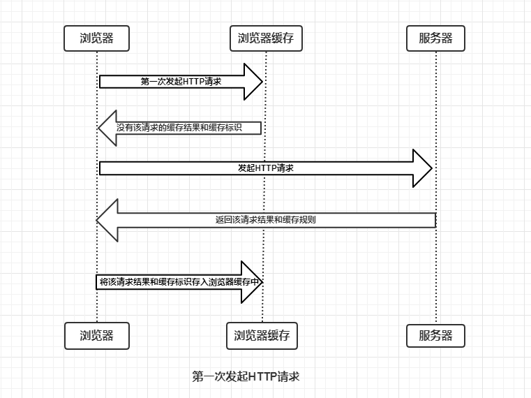
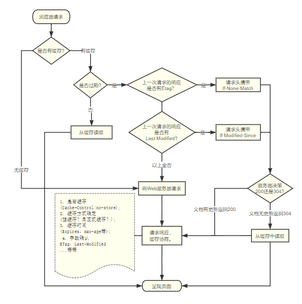

cookie、webStorage以及IndexedDB

cookie的存在更多的是为了让服务端区别用户，webStorage和IndexedDB则更多用在保存具体的数据和在客户端存储大量结构化数据(文件/blobs)上面。


#### 缓存过程分析




缓存 **请求资源的副本**


HTTP协议里定义了很多关于缓存的请求和响应字段


好处

1. 缓解服务器压力(不用每次去请求资源)；
2. 提升性能(打开本地资源速度当然比请求回来再打开要快得多)；
3. 减少带宽消耗(我相信你可以理解)；


浏览器缓存，代理服务器缓存

缓存在宏观上可以分成两类：**私有缓存**和**共享缓存**。共享缓存就是那些能被各级代理缓存的缓存(咋觉得有点绕)。私有缓存就是用户专享的，各级代理不能缓存的缓存

**浏览器对于缓存的处理是根据第一次请求资源时返回的响应头来确定的。**


```
Age:23146
Cache-Control:max-age=2592000 // HTTP 1.1 缓存过期相对时间，优先级高
Date:Tue, 28 Nov 2017 12:26:41 GMT
ETag:W/"5a1cf09a-63c6" // 对文件的标记
Expires:Thu, 28 Dec 2017 05:27:45 GMT  // HTTP 1.0 缓存过期绝对时间
Last-Modified:Tue, 28 Nov 2017 05:14:02 GMT // 文件最后一次修改时间
Vary:Accept-Encoding

```

#### 强缓存阶段

强制缓存就是向浏览器缓存查找该请求结果，并根据该结果的缓存规则来决定是否使用该缓存结果的过程，强制缓存的情况主要有三种

- 不存在缓存标识：直接请求
- 存在缓存标识，但结果失效：**协商缓存**
- 存在缓存标识，且结果未失效：直接返回结果

```
// 与上述的Last-Modified，ETag对应，If优先级低
If-Moified-Since: Tue, 28 Nov 2017 05:14:02 GMT
If-None-Match: W/"5a1cf09a-63c6"
```

#### 协商缓存阶段

过期后进入协商缓存阶段 

请求携带这两个字段，服务器以此判断资源是否修改

修改：返回200 和新的内容

未修改：返回304 加载本地缓存（Chrome，firefox不会）

#### 启发式缓存阶段

```
Age:23146
Cache-Control: public
Date:Tue, 28 Nov 2017 12:26:41 GMT
Last-Modified:Tue, 28 Nov 2017 05:14:02 GMT
Vary:Accept-Encoding
```

确定缓存过期时间的字段一个都没有！

**根据响应头中2个时间字段 Date 和 Last-Modified 之间的时间差值，取其值的10%作为缓存时间周期。**




Expires有一个很大的弊端，就是它返回的是服务器的时间，但判断的时候用的却是客户端的时间


##### If-Unmodified-Since

这个字段字面意思和`If-Modified-Since`相反，但处理方式并不是相反的。如果文件在两次访问期间没有被修改则返回200和资源，如果文件修改了则返回状态码412(预处理错误)。


**用途：**

- 与含有 `If-Range`消息头的范围请求搭配使用，实现断点续传的功能，即如果资源没修改继续下载，如果资源修改了，续传的意义就没有了。
- POST、PUT请求中，优化并发控制，即当多用户编辑用一份文档的时候，如果服务器的资源已经被修改，那么在对其作出编辑会被拒绝提交


`Last-Modified`有几个缺点：没法准确的判断资源是否真的修改了，比如某个文件在1秒内频繁更改了多次，根据Last-Modified的时间(单位是秒)是判断不出来的，再比如，某个资源只是修改了，但实际内容并没有发生变化，Last-Modified也无法判断出来，因此在HTTP/1.1中还推出了`ETag`这个字段


https://juejin.im/entry/5ad86c16f265da505a77dca4

https://juejin.im/post/5a6c87c46fb9a01ca560b4d7

https://github.com/frontend9/fe9-interview/issues/29